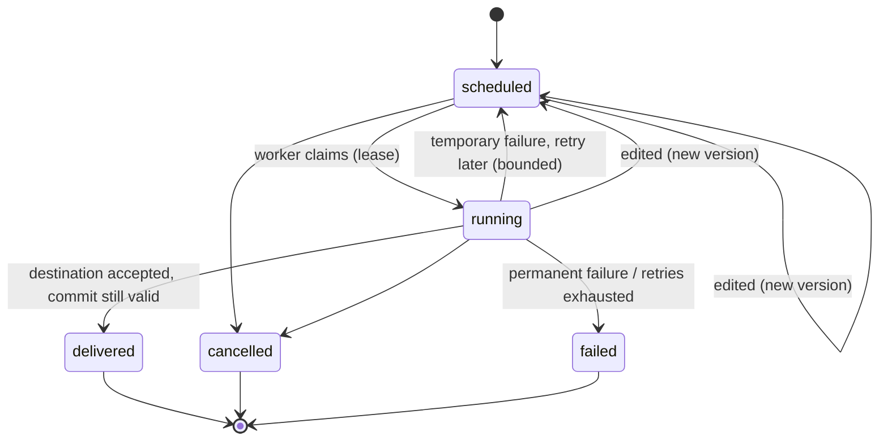

# Durable Reminders and Follow-Ups

A small service that keeps its promises: "remind me tomorrow morning" or "let's continue on Friday" survives a
restart, respects the user's time zone, retries when delivery fails, and never notifies twice for the same
scheduled occurrence, even when the scheduler fires twice or the user edits or cancels at the worst moment.

TypeScript · Node 22.13+ · SQLite (Node's built-in `node:sqlite`, nothing native to compile) · Hono REST API ·
Temporal (`@js-temporal/polyfill`) for time zones · Vitest · CLI

## Quick start

Requirements: **Node.js 22.13+** (check with `node -v`; an `.nvmrc` is included). Developed and tested on Node 22.22, Linux.

```bash
npm install
npm run verify        # typecheck + 86 tests + verification benchmark
```

| Command | What it does |
| --- | --- |
| `npm test` | 86 deterministic tests: injected clock, no sleeps, no network, no paid provider |
| `npm run benchmark` | Verification benchmark: 23 items, 4 zones, a restart, a duplicate execution, exactly-once accounting |
| `npm run demo` | Scripted walkthrough with controlled time (delivery, DST, restart, retries, edit, cancel, duplicate execution) |
| `npm run rest-demo` | Starts the real HTTP server on a free port and drives the whole REST API with `fetch` |
| `npm run serve` | Runs the REST API for real (real clock, background worker, database in `data/reminders.db`) |
| `npm run cli -- <command>` | Create, list, show, edit, cancel, tick (see below) |
| `npm run typecheck` | `tsc --noEmit` |

## REST API

| Method and path | Purpose |
| --- | --- |
| `POST /reminders` | Create. `201` created, `200` if the same id and request is replayed, `409 id_conflict` if the id holds different content |
| `GET /reminders?state=` | List, optionally filtered by state |
| `GET /reminders/:id` | Inspect: item, ordered attempt history, version history |
| `PATCH /reminders/:id` | Edit. Body needs `expectedVersion`; a stale one is `409 version_mismatch` |
| `POST /reminders/:id/cancel` | Cancel (idempotent) |
| `GET /health` | Liveness |

Create body: `{ "id"?, "kind"?: "reminder"|"follow_up", "content", "timeZone", "at", "conversationId"? }` where `at` is either a
**local wall-clock time** without offset (`"2026-03-08T09:00"`, read in `timeZone`) or an **instant** with `Z`/offset.

When started with `--manual-clock` (or via `npm run rest-demo`) there are also `GET/POST /admin/clock` and
`POST /admin/tick`, so a reviewer can move time and trigger processing by hand. They do not exist with the real clock.

Try it (Windows PowerShell):

```powershell
npm run serve
# in a second terminal:
$due  = (Get-Date).ToUniversalTime().AddSeconds(5).ToString("yyyy-MM-ddTHH:mm:ssZ")
$body = @{ id = "call-1"; content = "Call mom"; timeZone = "Asia/Kolkata"; at = $due } | ConvertTo-Json
Invoke-RestMethod -Method Post -Uri http://localhost:3000/reminders -ContentType "application/json" -Body $body
Start-Sleep 7
Invoke-RestMethod http://localhost:3000/reminders/call-1     # state: delivered, with attempt history
```

macOS / Linux:

```bash
curl -s -X POST localhost:3000/reminders -H 'content-type: application/json' \
  -d "{\"id\":\"call-1\",\"content\":\"Call mom\",\"timeZone\":\"Asia/Kolkata\",\"at\":\"$(date -u -d '+5 seconds' +%FT%TZ)\"}"
```

## CLI with controlled time

Add `--now <ISO instant>` to any command to run it "at" that moment instead of the real time.

```bash
npm run cli -- create --id cli-1 --content "Call mom" --tz Asia/Kolkata --at 2026-03-08T09:00 --now 2026-03-07T00:00:00Z
npm run cli -- edit cli-1 --expected-version 1 --at 2026-03-08T10:00 --now 2026-03-07T00:00:00Z
npm run cli -- tick --now 2026-03-08T04:29:59Z      # nothing due yet
npm run cli -- tick --now 2026-03-08T04:30:00Z      # delivered
npm run cli -- show cli-1
npm run cli -- tick --fault temporary --now ...     # make the destination fail once per item, to see retries
```

## How it fits together

```
 REST API / CLI ──► ReminderService ──► SchedulerStore (SQLite) ◄── Worker ──► Notifier (idempotent by delivery key)
  (thin)            validation, time      the ONLY source of        discover → claim → fence
                    zones, versions       truth: items, attempts,   → send → guarded commit
                                          versions, deliveries      / retry / fail
```



```
src/
  types.ts service.ts        domain types, create/edit/cancel/inspect rules
  time.ts                    IANA zone + local time -> instant, with an explicit DST policy
  worker.ts settle.ts        discovery, claiming, delivery, retry; "advance the clock until settled"
  retryPolicy.ts notifier.ts fakeNotifier.ts   retry rules, delivery boundary, local fake destination
  store/                     SchedulerStore interface + SQLite implementation (schema-level guards)
  api.ts server.ts           Hono REST API and server wiring
  cli.ts demo.ts restDemo.ts render.ts         presentation
  benchmark/                 verification benchmark
test/                        time, service, worker, restart, store guards, REST, benchmark
```

Design decisions, trade-offs, requirement and acceptance-scenario coverage, and the AI-usage disclosure are in
[`SUBMISSION.md`](SUBMISSION.md). A recording script for the demo video is in [`DEMO.md`](DEMO.md).
